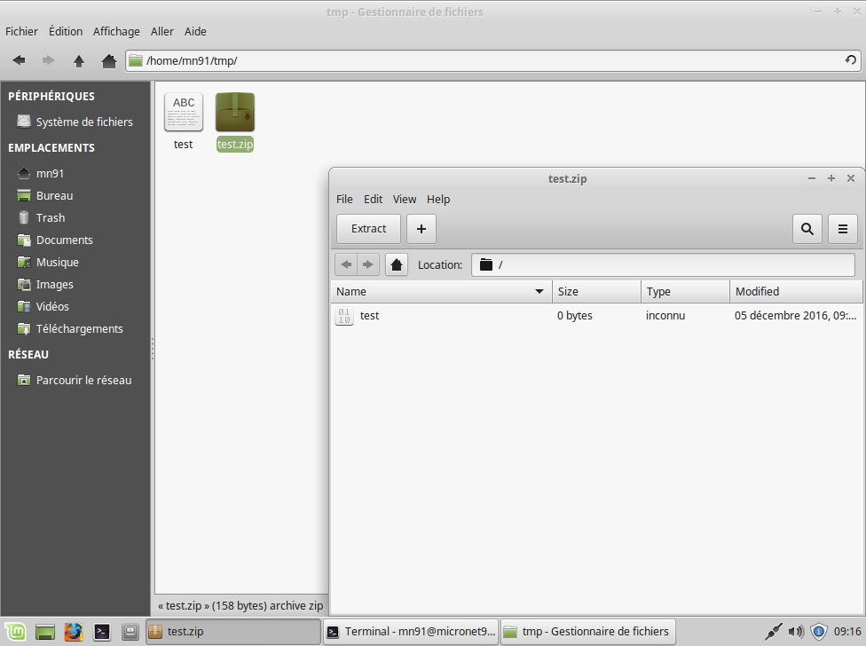

Fonctionnement de Linux
=======================

Pour la suite nous allons avoir besoin de connaître les éléments suivants :

- Un éditeur de texte ;
- Un gestionnaire de fichier ;
- Le terminal.

Structure de fichier sous Linux
-------------------------------

Qu'est-ce qu'une partition ?
~~~~~~~~~~~~~~~~~~~~~~~~~~~~

Les fichiers sont stockés sur des partititions sous Linux. Les partitions sont montés dans l'arborescence de Linux.

.. note:: La notion de lettre pour une partition (C:, D:, E:) n'existent pas sous Linux.

Les partitions peuvent être créées à l'aide de **gparted** (en mode graphique) ou **fdisk** en ligne de commande. Une partition se définie sur un disque à l'aide des éléments suivants :

- Un disque (sda, sdb, ...) ;
- Un numéro de partition (1, 2, ...).

Ainsi, la première partition du premier disque sur votre machine sera vu comme sda1, la seconde comme sda2, la 1ier partition du second disque comme sdb1.

Gestion d'une partition
~~~~~~~~~~~~~~~~~~~~~~~

Les partitions sont montées automatiquement au démarrage grâce au contenu du fichier **/etc/fstab**. Essayons d'afficher le contenu de ce fichier à l'aide de la commande cat :

.. code-block:: bash

    cat /etc/fstab

::

    # /etc/fstab: static file system information.
    #
    # Use 'blkid' to print the universally unique identifier for a
    # device; this may be used with UUID= as a more robust way to name devices
    # that works even if disks are added and removed. See fstab(5).
    #
    # <file system> <mount point>   <type>  <options>       <dump>  <pass>
    # / was on /dev/sda1 during installation
    UUID=a337176a-5cae-44b3-82e2-0d9052821927 /               ext4    errors=remount-ro 0       1
    # swap was on /dev/sda5 during installation
    UUID=797fe69c-2ba2-442f-9eda-2aa836ff6162 none            swap    sw              0       0
    /dev/sdb /var/lib/docker btrfs   defaults        0       0

Chaque partition est ensuite formatée dans un système de fichier. Dans la plupart des cas on aura du ext4 ou swap mais on peut également retrouver xfs, btrfs et bien sûr vfat ou ntfs dans le cas d'une partition Windows.

Il est possible de lister les partitions montées à l'aide de la commande **df** :

.. code-block:: bash

    df -h

::

    Sys. de fichiers Taille Utilisé Dispo Uti% Monté sur
    udev               4,9G       0  4,9G   0% /dev
    tmpfs             1000M    9,2M  991M   1% /run
    /dev/sda1           40G     28G   11G  74% /
    tmpfs              4,9G    479M  4,5G  10% /dev/shm
    tmpfs              5,0M    4,0K  5,0M   1% /run/lock
    tmpfs              4,9G       0  4,9G   0% /sys/fs/cgroup
    /dev/sdb            50G     17G   33G  33% /var/lib/docker
    tmpfs             1000M     20K 1000M   1% /run/user/1000
    C_DRIVE            238G    206G   33G  87% /media/sf_C_DRIVE
    D_DRIVE            224G    155G   70G  70% /media/sf_D_DRIVE
    tmpfs             1000M       0 1000M   0% /run/user/0

.. note:: le type de système de fichier **tmpfs** est un cas particulier et correspond à des partitions volatiles : elles sont gérées par le système en mémoire et ne sont pas persistantes.

Gérer des fichiers sous Linux
-----------------------------

Il est tout à fait possible de se passer complétement de la ligne de commande pour manipuler des fichiers.

   Ouverture d'un zip depuis le gestionnaire de fichier.

Pour le faire depuis la ligne de commande, vous pouvez utiliser la commande **ls** :

- Lister les fichiers et dossiers

- ls : Affichage des fichiers
- ls -l : même chose avec informations droits/tailles
- ls -ltr : affichage dans l'ordre inverse

A la recherche d'une option ?
- **-h** ou **--help**
- man **COMMANDE**
- google

Droits sous Linux
-----------------

- Introduction aux droits
- Notion de groupes/propriétaires
- Afficher les process

