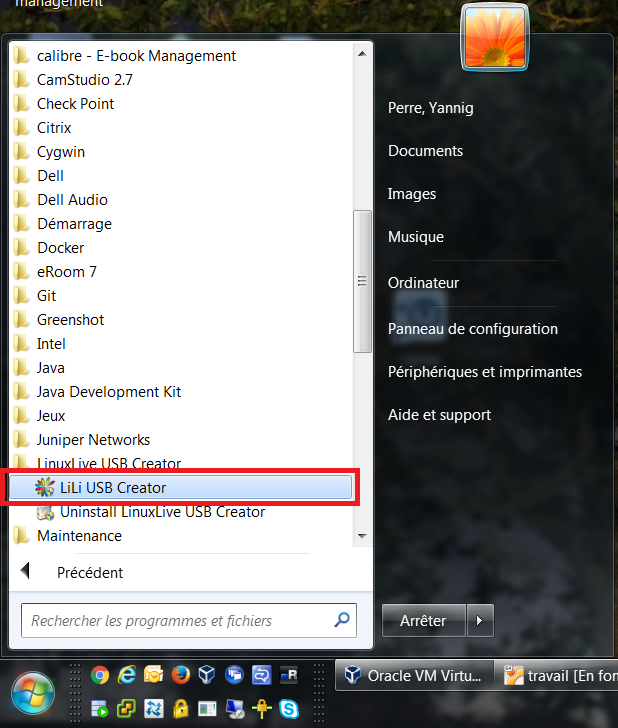
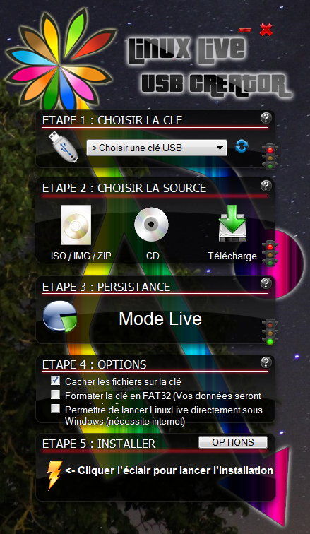

Création d'une clé USB Linux
============================

Téléchargement de Lili USB
--------------------------

Première étape, récupérer la dernière version de Lily USB sur le site suivant : http://www.linuxliveusb.com/fr/download

Lancer l'installation en se rendant sur le répertoire des téléchargements.

Lancement de Lili USB
---------------------

Dans le menu, lancer Lili USB :

Dans la fenêtre de Lili, renseigner les champs suivants :

- La lettre du lecteur correspondant à la clé USB ;
- La source (iso) ;
- Eventuellement la persistance ;
- Cocher formatage en fat32 ;
- Enfin cliquer sur l'éclair pour lancer la préparation de la clé.

Ceci fait, nous allons pouvoir lancer la clé USB live sur notre PC.

