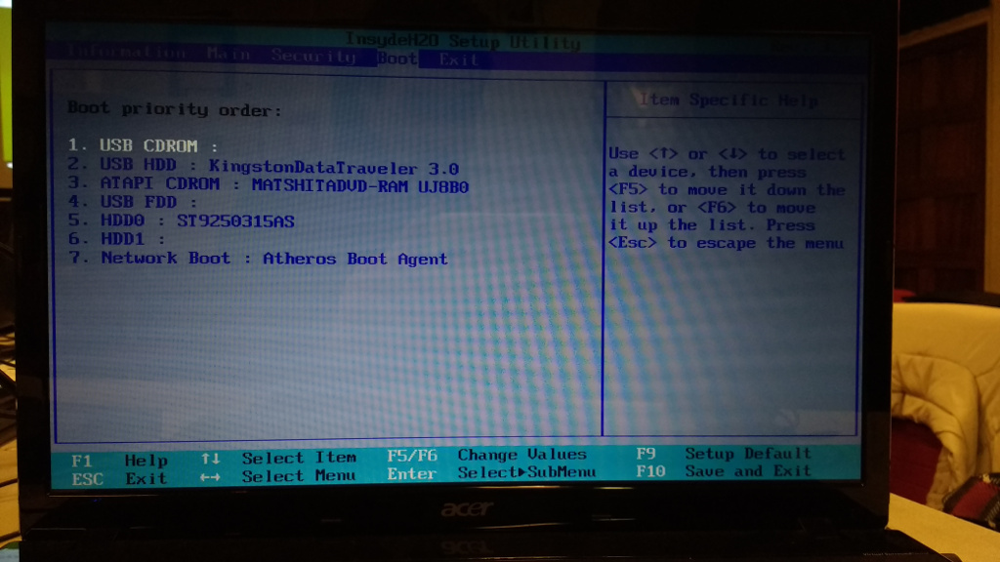

Démarrage Linux via clé USB
===========================

Une fois la clé prête, il est maintenant possible de démarrer sous Linux.

Lancement de Linux depuis la clé USB
------------------------------------

Au redémarrage de la machine, appuyer sur la touche **F2** pour entrer dans le bios. Se rendre dans la section **Boot** et s'assurer de la présence de la clé USB dans la liste des disques et surtout que la clé se trouve devant le disque dur (ligne HDD0) en ordre de priorité. Utiliser les touches **F5/F6** pour éventuellement changer les priorités. Ceci fait, faire **F10** et confirmer la sauvegarde (**[YES]**).

   Ordre de démarrage des disques de la machine.

Le PC portable devrait alors afficher un logo de Linux Mint. Surtout ne pas laisser la machine démarrer directement et appuyer sur une touche.

.. note:: Un bug graphique sur les portables de l'association empêche de pouvoir démarrer proprement en mode normal. Ce bug disparait en utilisant le mode **fail safe**.

Dans le menu qui apparaît, sélectionner le mode **Fail safe** : ce mode désactivera certaines options au démarrage de Linux.

Installation de Linux
---------------------

À partir de maintenant, il est possible d'installer Linux sur notre machine. Pour se faire, suivre la procédure suivante : :ref:`installation-linux-mint-xfce-18`.

Découverte du bureau
--------------------

Il n'est pas forcément nécessaire de faire l'installation de Linux pour passer à la découverte du bureau XFCE (:ref:`decouverte-bureau-xfce`). Il faut juste savoir que la langue du bureau et le clavier seront configurés en Anglais.
