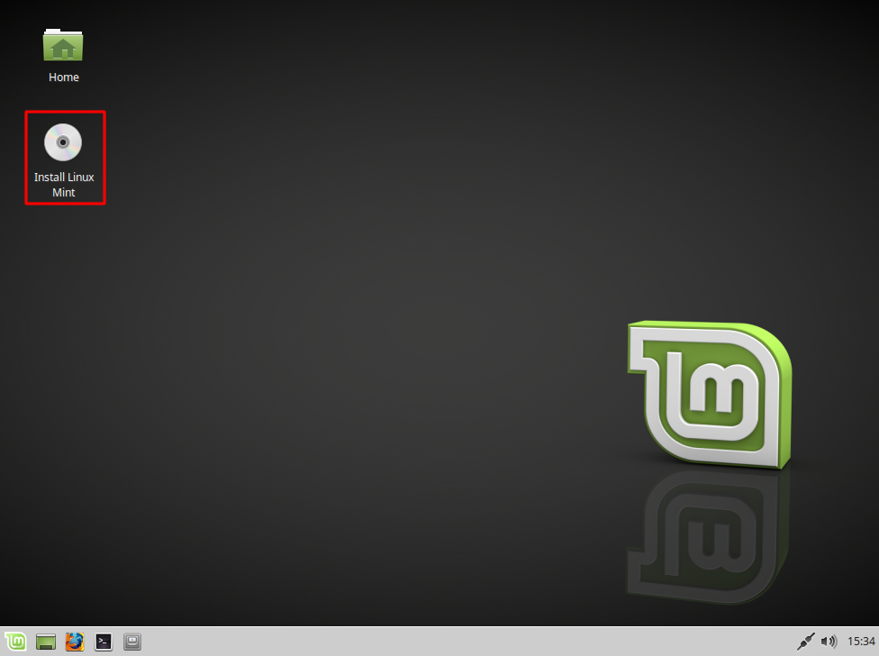
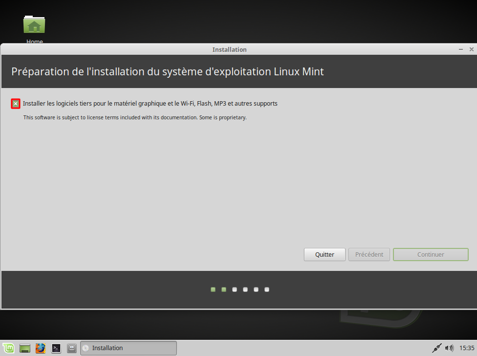
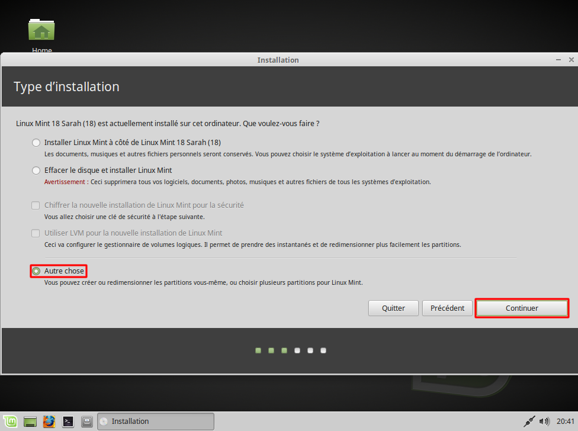

.. _installation-linux-mint-xfce-18:

Installation de Linux Mint 18
=============================

Démarrage sur la clé USB
------------------------

Une fois notre clé USB prête, nous allons voir ensemble comment procéder à l'installation de Linux Mint sur notre Ordinateur.

.. warning:: Cette opération va supprimer Windows de votre ordinateur. Il est conseillé de faire une sauvegarde de ses données avant d'aller plus loin.

Pour se faire, rentrer dans le bios et assurez-vous de la présence de la clé USB dans la liste des disques disponibles dans la séquence de démarrage.

Lancement de l'installation
---------------------------

   Écran d'accueil de Linux XFCE 18.

   Choix de la langue.

   Utilisation des plugins tiers.

   Comment installer les fichiers du système sur votre ordinateur.

   Fuseau horaire de l'ordinateur. Ne rien changer à ce niveau.

   Disposition du clavier. Laisser la valeur par défaut.

   Création d'un utilisateur et choix de sa connexion au démarrage.

   Déroulement de l'installation.

   Fin de l'installation et redémarrage.
